   

  

    
    &nbsp;&nbsp;
    
    &nbsp;&nbsp;
    
    &nbsp;&nbsp;
    
  

---

### 💻 Sobre Mim

* 👨‍💻 Estou aprendendo programação e desenvolvendo lógica.
* 📚 Cursando e aplicando conhecimentos de JavaScript, HTML, CSS e MySQL.
* 🚀 Em constante evolução na tecnologia!

---

### 📊 Estatísticas do GitHub

---

### 🛠️ Minhas Habilidades

 
  &nbsp;&nbsp;&nbsp;&nbsp;
  &nbsp;&nbsp;&nbsp;&nbsp;
  &nbsp;&nbsp;&nbsp;&nbsp;
  &nbsp;&nbsp;&nbsp;&nbsp;
  &nbsp;&nbsp;&nbsp;&nbsp;
   

